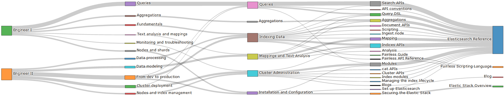

# Tips for Elastic Certified Engineer Exam



## About outline

Mapping with Elastic Training outlines <-> Elastic Exam outlines <-> Elastic Docs

| file             | info
| ---              | --
| `outline.xlsx`   | outline full mapping spreadsheet
| `outlines.json`  | outline full mapping in json format
| `outline.html`   | outline full mapping sankey diagram

## About dockfiles

Testing environments for exam preparation

| file                        | info
| ---                         | --
| `single_node.yml`           | simple testing env
| `node_role.yml `            | cluster and node role env
| `elastic_security.yml`      | elastic stack security env
| `backup_and_recovery.yml`   | backup and recovery env
| `cross_cluster_search.yml`  | cross cluster search env
| `shard_allocation.yml`      | shard allocation env

## How to use dockerfiles

Startup a test env in foreground:

```
docker-compose -f your_config_file.yml up
```

Or Startup a test env in background:

```
docker-compose -f your_config_file.yml up -d
```

Shutdown a test env:

```
docker-compose -f your_config_file.yml down
```
Or Shutdown a test env and data:

```
docker-compose -f your_config_file.yml down -v
```